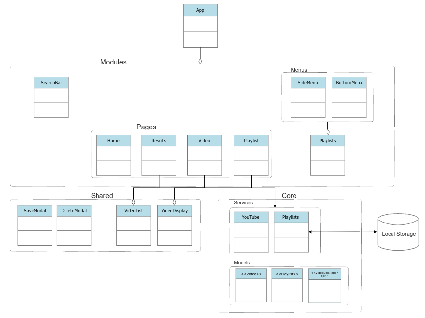

# **YouTube Video Player and Playlist Manager**

This application is an Angular-based web application for searching, playing YouTube music videos, and creating custom playlists.

## **Architecture**
1. Please see the UML diagram for a high-level diagram. 
2. The app is built following DRY principle. 
3. The app is divided into 3 main modules: `core`, `shared`, and `modules`.
4. Services are used to handle business logic and data retrieval.

## **Features**

- **Video Search**: Allows users to search for YouTube videos by keyword.
- **Video page**: Displays the selected video with its title and other metadata
- **Playlist Management**: Allows users to display, create, and delete custom playlists.

## **Prerequisites**

To run the app locally, you need:

- Node.js and npm installed.
- Angular CLI.

## **Setup and Running**

1. Clone the repository.
2. Run `npm install` to install the dependencies.
3. Run `ng serve` to run the app locally. Navigate to `http://localhost:4200/` to view the app in the browser.

## **Considerations**
1. The app uses the [YouTube Data API v3](https://developers.google.com/youtube/v3) to search for videos and retrieve video metadata.
2. The app uses Material Design components for the UI.
3. There are no unit tests for the app, which was out of scope for this project.
4. The app is responsive and can be viewed on mobile devices.
5. The app uses local storage to store the playlists but is ready to be connected to a backend service instead.
6. If I had more time I would:
    - Add unit tests.
   - Support a backend service that stores the playlists.
    - Add dark mode.
    - Add loading spinners and more animations.

